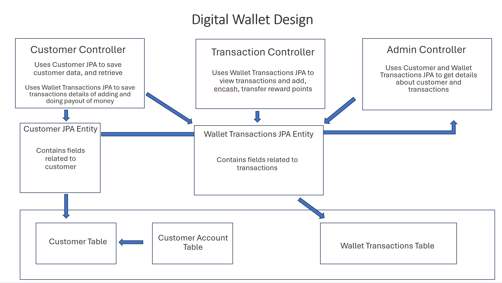

# Design Implementation
### Application name - Digital Wallet
### Purpose - 
    1. To handle storing and updating of customer details. 
    2. Their transactions like adding money and payout etc.
    3. Giving access to admin to check and to top level changes to customers details.

### Technology Used - Spring boot

### Design proposal-

    This application currently has following components
    
##### Customer 
    A customer is a normal user who can do sign up with the system
    and to transactions like adding money, doing payout of money. Customer
    can also get reward points for the transactions done by them. These are
    handled through below end points*:

    customer/signup - a new user can register as customer
    customer/login - a customer can login

    transaction/addmoney - a customer can add money to wallet
    transaction/payoutmoney - a customer can payout money from wallet
    transaction/viewtransactions - a customer can view all transactions by passing id
    transaction/earnpoints - a customer get points for transactions
    transaction/transferpoints - a customer can transfer points
    transaction/encashpoints - a customer can encash points

    *sample request and response given at the end of doc

##### Admin
    A admin is a super user who can see all customer, change their status as activated/restricted etc.,
    view account and transactions of customer. These are endpoints available to admin*:

    admin/viewusers - used to view all registered users
    admin/changeuserstatus - change status of a registered user
    admin/viewusertransactions - view transactions of all users
    admin/viewuseraccount - view account details of all users

    *sample request and response given at the end of doc

#### Sample Request bodies
    customer/signup
        {"name": "name", "password": "secured", "username": "username"}
            **user id is obtained in response which is required for other endpoints    
    
    customer/login
        {"username": "username", "password": "secured"}

    transaction/addmoney - a customer can add money to wallet
        {"id": 0, "moneyToAdd": 0}
            id is user id obtained in siging up

    transaction/payoutmoney
        {"id": 0, "moneyToPayout": 0}
            id is user id obtained in siging up

    transaction/viewtransactions
        {"id": 0}
            id is user id obtained in siging up

    transaction/earnpoints
        {"id": 0, "pointsToAdd": 0}
            id is transaction id that can be obtained from database

    transaction/transferpoints
        {"id": 0, "pointsToTrasnfer": 0}
            id is transaction id that can be obtained from database

    transaction/encashpoints - a customer can encash points
        {"id": 0, "pointsToEncash": 0}
            id is transaction id that can be obtained from database

    admin/viewusers
        no request body required

    admin/changeuserstatus
        {"newStatus": "string", "reasonForNewStatus": "string", "userId": 0}
            id is user id obtained in siging up

    admin/viewusertransactions
        no request body required

    admin/viewuseraccount
        {"userId": 0}
            id is user id obtained in siging up